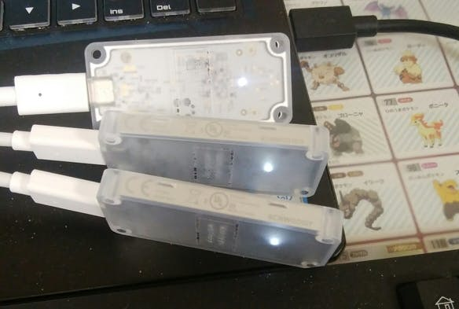
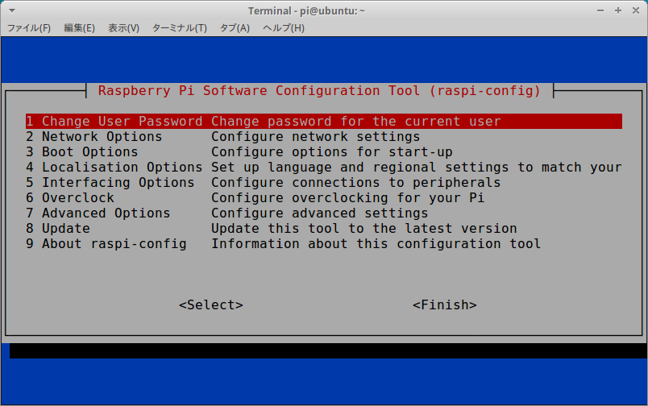
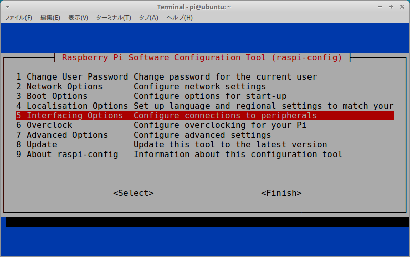
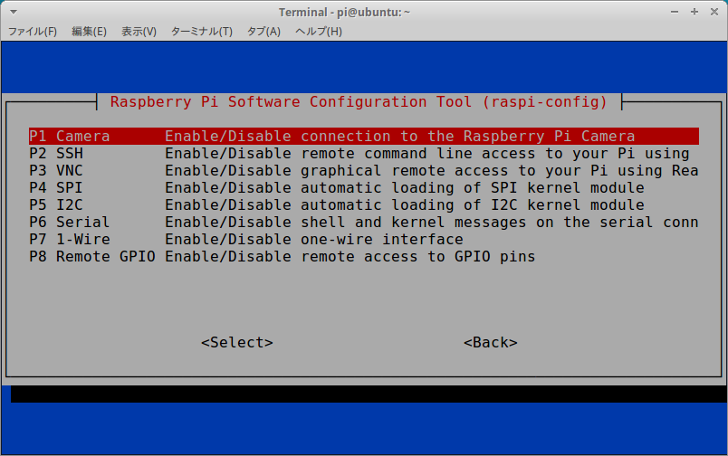
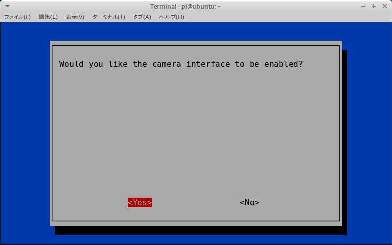
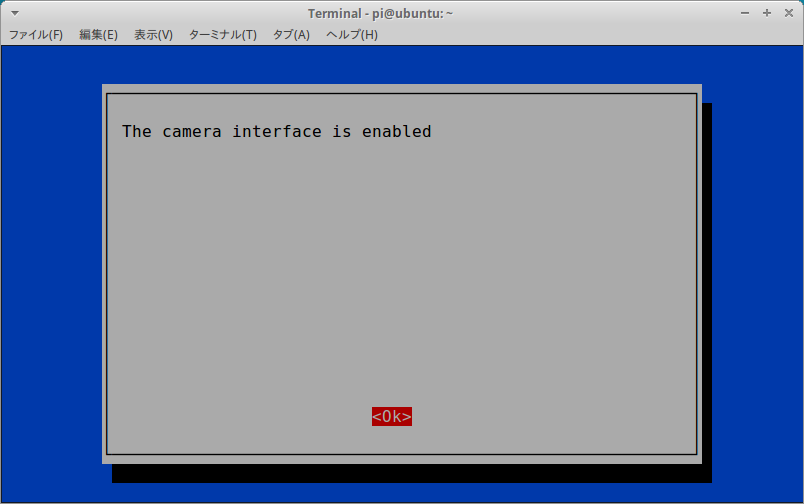
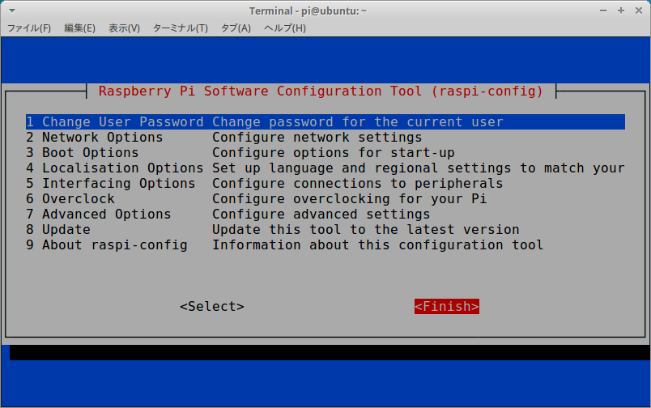

# TPU-Posenet
Edge TPU Accelerator/Multi-TPU/Multi-Model + Posenet/DeeplabV3/MobileNet-SSD + Python + Sync/Async + LaptopPC/RaspberryPi.  
Inspired by **[google-coral/project-posenet](https://github.com/google-coral/project-posenet)**.  
This repository was tuned to speed up Google's sample logic to support multi-TPU. And I replaced the complex Gstreamer implementation with the OpenCV implementation.  

## 0. Table of contents
**1. [Environment](#1-environment)**  
**2. [Inference behavior](#2-inference-behavior)**  
　**2-1. [Async, TPU x3, USB Camera, Single Person](#2-1-async-tpu-x3-usb-camera-single-person)**  
　**2-2. [Sync, TPU x1, USB Camera, Single Person](#2-2-sync-tpu-x1-usb-camera-single-person)**  
　**2-3. [Sync, TPU x1, MP4 (30 FPS), Multi Person](#2-3-sync-tpu-x1-mp4-30-fps-multi-person)**  
　**2-4. [Async, TPU x3, USB Camera (30 FPS), Multi-Model, Posenet + DeeplabV3 + MobileNet-SSDv2](#2-4-async-tpu-x3-usb-camera-30-fps-multi-model-posenet--deeplabv3--mobilenet-ssdv2)**  
**3. [Introduction procedure](#3-introduction-procedure)**  
　**3-1. [Common procedures for devices](#3-1-common-procedures-for-devices)**  
　**3-2-1. [Only Linux](#3-2-1-only-linux)**  
　**3-2-2. [Only RaspberryPi (Stretch or Buster)](#3-2-2-only-raspberrypi-stretch-or-buster)**  
**4. [Usage](#4-usage)**  
**5. [Reference articles](#5-reference-articles)**  

## 1. Environment

- Ubuntu or RaspberryPi
    - **(Note: Because RaspberryPi3 is a low-speed USB 2.0, multi-TPU operation becomes extremely unstable.)**
- OpenCV4.1.1-openvino
- Coral Edge TPU Accelerator (Multi-TPU)
    - Automatically detect the number of multiple TPU accelerators connected to a USB hub to improve performance.
- USB Camera (Playstationeye)
- Picamera v2
- Self-powered USB 3.0 Hub
- Python 3.5.2+



## 2. Inference behavior
### 2-1. Async, TPU x3, USB Camera, Single Person
**Youtube：https://youtu.be/LBk71RKca1c**  
  
  
### 2-2. Sync, TPU x1, USB Camera, Single Person
**Youtube：https://youtu.be/GuuXzpLXFJo**  
  
  
### 2-3. Sync, TPU x1, MP4 (30 FPS), Multi Person
**Youtube：https://youtu.be/ibPuI12bj2w**  
  
  
### 2-4. Async, TPU x3, USB Camera (30 FPS), Multi-Model, Posenet + DeeplabV3 + MobileNet-SSDv2
**Youtube：https://youtu.be/d946VOE65tU**  
  

## 3. Introduction procedure
### 3-1. Common procedures for devices
```bash
$ sudo apt-get update;sudo apt-get upgrade -y

$ sudo apt-get install -y python3-pip
$ sudo pip3 install pip --upgrade
$ sudo pip3 install numpy

$ wget https://dl.google.com/coral/edgetpu_api/edgetpu_api_latest.tar.gz -O edgetpu_api.tar.gz --trust-server-names
$ tar xzf edgetpu_api.tar.gz
$ sudo edgetpu_api/install.sh

$ git clone https://github.com/PINTO0309/TPU-Posenet.git
$ cd TPU-Posenet.git
$ cd models;./download.sh;cd ..
$ cd media;./download.sh;cd ..
```
### 3-2-1. Only Linux
```bash
$ wget https://github.com/PINTO0309/OpenVINO-bin/raw/master/Linux/download_2019R2.sh
$ chmod +x download_2019R2.sh
$ ./download_2019R2.sh
$ l_openvino_toolkit_p_2019.2.242/install_openvino_dependencies.sh
$ ./install_GUI.sh
OR
$ ./install.sh
```
### 3-2-2. Only RaspberryPi (Stretch or Buster)
```bash
### Only Raspbian Buster ############################################################
$ cd /usr/local/lib/python3.7/dist-packages/edgetpu/swig/
$ sudo cp \
_edgetpu_cpp_wrapper.cpython-35m-arm-linux-gnueabihf.so \
_edgetpu_cpp_wrapper.cpython-37m-arm-linux-gnueabihf.so
### Only Raspbian Buster ############################################################

$ cd ~/TPU-Posenet
$ sudo pip3 install imutils
$ sudo raspi-config
```
  
  
  
  
  
  
```bash
$ wget https://github.com/PINTO0309/OpenVINO-bin/raw/master/RaspberryPi/download_2019R2.sh
$ sudo chmod +x download_2019R2.sh
$ ./download_2019R2.sh
$ echo "source /opt/intel/openvino/bin/setupvars.sh" >> ~/.bashrc
$ source ~/.bashrc
```
## 4. Usage
```bash
usage: pose_camera_multi_tpu.py [-h] [--model MODEL] [--usbcamno USBCAMNO]
                                [--videofile VIDEOFILE] [--vidfps VIDFPS]

optional arguments:
  -h, --help            show this help message and exit
  --model MODEL         Path of the detection model.
  --usbcamno USBCAMNO   USB Camera number.
  --videofile VIDEOFILE
                        Path to input video file. (Default="")
  --vidfps VIDFPS       FPS of Video. (Default=30)
```
```bash
usage: pose_camera_single_tpu.py [-h] [--model MODEL] [--usbcamno USBCAMNO]
                                 [--videofile VIDEOFILE] [--vidfps VIDFPS]

optional arguments:
  -h, --help            show this help message and exit
  --model MODEL         Path of the detection model.
  --usbcamno USBCAMNO   USB Camera number.
  --videofile VIDEOFILE
                        Path to input video file. (Default="")
  --vidfps VIDFPS       FPS of Video. (Default=30)
```
```bash
usage: pose_picam_multi_tpu.py [-h] [--model MODEL] [--videofile VIDEOFILE] [--vidfps VIDFPS]

optional arguments:
  -h, --help            show this help message and exit
  --model MODEL         Path of the detection model.
  --videofile VIDEOFILE
                        Path to input video file. (Default="")
  --vidfps VIDFPS       FPS of Video. (Default=30)
```
```bash
usage: pose_picam_single_tpu.py [-h] [--model MODEL] [--videofile VIDEOFILE] [--vidfps VIDFPS]

optional arguments:
  -h, --help            show this help message and exit
  --model MODEL         Path of the detection model.
  --videofile VIDEOFILE
                        Path to input video file. (Default="")
  --vidfps VIDFPS       FPS of Video. (Default=30)
```
```bash
usage: ssd-deeplab-posenet.py [-h] [--pose_model POSE_MODEL]
                              [--deep_model DEEP_MODEL]
                              [--ssd_model SSD_MODEL] [--usbcamno USBCAMNO]
                              [--videofile VIDEOFILE] [--vidfps VIDFPS]
                              [--camera_width CAMERA_WIDTH]
                              [--camera_height CAMERA_HEIGHT]

optional arguments:
  -h, --help            show this help message and exit
  --pose_model POSE_MODEL
                        Path of the posenet model.
  --deep_model DEEP_MODEL
                        Path of the deeplabv3 model.
  --ssd_model SSD_MODEL
                        Path of the mobilenet-ssd model.
  --usbcamno USBCAMNO   USB Camera number.
  --videofile VIDEOFILE
                        Path to input video file. (Default="")
  --vidfps VIDFPS       FPS of Video. (Default=30)
  --camera_width CAMERA_WIDTH
                        USB Camera resolution (width). (Default=640)
  --camera_height CAMERA_HEIGHT
                        USB Camera resolution (height). (Default=480)
```
## 5. Reference articles
1. **[Edge TPU USB Accelerator analysis - I/O data transfer - Qiita - iwatake2222](https://qiita.com/iwatake2222/items/922f02893355b30dab2e)**  

2. **[[150 FPS ++] Connect three Coral Edge TPU accelerators and infer in parallel processing to get ultra-fast object detection inference performance ーTo the extreme of useless high performanceー - Qiita - PINTO](https://qiita.com/PINTO/items/63b6f01eb22a5ab97901)**  

3. **[[150 FPS ++] Connect three Coral Edge TPU accelerators and infer in parallel processing to get ultra-fast Posenet inference performance ーTo the extreme of useless high performanceー - Qiita - PINTO](https://qiita.com/PINTO/items/e969fa7601d0868e451f)**  

4. **[Raspberry Pi Camera Module](https://www.raspberrypi.org/documentation/raspbian/applications/camera.md)**  
